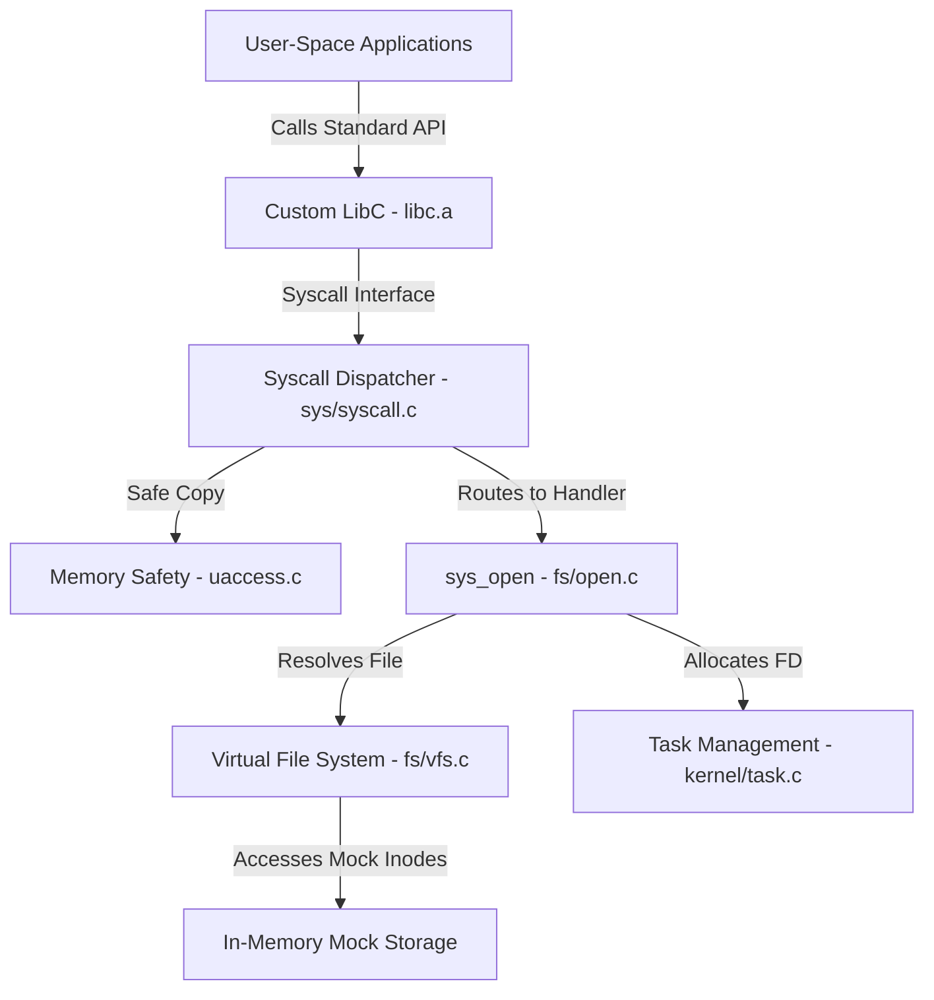

# DeLFS Operating System Roadmap

Welcome to the **DeLFS (Linux From Scratch, but without the Linux Kernel and glibc)** development roadmap. DeLFS is a custom UNIX-like operating system built from scratch, replacing the Linux kernel with a custom kernel subsystem and glibc with a minimal C library clone on the **x86_64** architecture.

This document outlines our current architecture, what has been implemented so far, and the development milestones planned for future releases.

---

## 🗺️ Project Architecture Overview



---

## 📈 Current Project Status

We have built the foundational layout of both the kernel space and the user space library:

### ⚙️ Kernel Space
- [x] **System Call Routing:** Implemented dispatcher router (`sys/syscall.c`) to receive user-space registers and forward to system call handlers.
- [x] **Virtual File System (VFS):** Implemented file/inode resolution and open file description tracking (`fs/vfs.c`).
- [x] **File Descriptor Management:** Implemented process task table mapping file descriptors to open kernel file objects (`kernel/task.c`).
- [x] **Memory Safety Layer:** Implemented `copy_str_from_user` checking and sanitization to prevent memory exploits when traversing user-to-kernel boundary (`kernel/uaccess.c`).
- [x] **System Calls:** Initial `sys_open` system call is implemented (`fs/open.c`).

### 📚 Custom LibC
- [x] **GNU libc Layout:** Organized using the standard glibc `sysdeps/` scheme prioritizing architecture-specific overrides (e.g. `sysdeps/delfs/x86_64`) over generic fallbacks.
- [x] **C Runtime Startup (`crt0.o`):** Assembly entry point (`_start`) implementing stack alignment, loading argument registers (`argc`, `argv`), calling C `main()`, and exiting with status code via syscall 60.
- [x] **Inline System Calls:** Provided helper macros for assembly-based system calls.
- [x] **Standard Library Core:** Implemented rudimentary standard functions including `fprintf`, `fflush`, `abort`, and `write`.

### 🛠️ Toolchain
- [x] Sourced upstream GCC 16.1.0 and Binutils 2.46.1.
- [/] Initial configuration for building cross-compilation toolchain targeting `delfs-x86_64`.

---

## 🚀 Milestones & Future Development Phases

### Phase 1: Toolchain Self-Hosting & Standard IO (v0.1)
*Goal: Complete the cross-compiler toolchain and run simple statically linked C binaries.*

- [ ] **Cross-Compiler Build:** Complete cross-compiler GCC build targeting `x86_64-delfs` to automatically reference DeLFS `sysroot` headers and `libc.a`.
- [ ] **Standard I/O System Calls:**
  - [ ] Implement kernel `sys_read` and `sys_write` handlers.
  - [ ] Implement kernel `sys_close` to release descriptors.
- [ ] **Console Standard Streams:** Support `stdin` (fd 0), `stdout` (fd 1), and `stderr` (fd 2) routing to console.
- [ ] **Dynamic Memory Allocation:**
  - [ ] Implement the `sys_brk` / `sys_sbrk` heap-allocation system calls.
  - [ ] Implement standard `malloc` and `free` inside LibC.

### Phase 2: QEMU Execution & Bootloading (v0.2)
*Goal: Move from in-memory test builds to executing a real kernel image on a simulated machine.*

- [ ] **Bootloader Integration:** Write a Multiboot2-compatible entry header and use GRUB to load the kernel image.
- [ ] **CPU Hardware Initialization:**
  - [ ] Set up the Global Descriptor Table (GDT) and Interrupt Descriptor Table (IDT).
  - [ ] Map page tables and enable x86_64 long mode.
- [ ] **Keyboard & Text Drivers:** 
  - [ ] Create VGA text-mode driver for screen prints.
  - [ ] Create PS/2 Keyboard driver to read input characters.
- [ ] **Physical Memory Allocator:** Page frame allocator (buddy system or bitmap-based) and kernel heap (`kmalloc`).

### Phase 3: Multitasking & User Mode (v0.3)
*Goal: Enable multiple processes running in isolated virtual address spaces.*

- [ ] **Context Switching & Scheduler:** Implement a cooperative / preemptive thread scheduler (Round-Robin).
- [ ] **User Space Ring 3 Transition:** Move CPU execution level from Kernel (Ring 0) to User (Ring 3).
- [ ] **Process Lifecycle Syscalls:**
  - [ ] Implement `sys_fork` to clone current task structures.
  - [ ] Implement `sys_execve` to load ELF binaries into memory.
  - [ ] Implement `sys_waitpid` for task cleanup.
- [ ] **Virtual Memory Management:** Dedicated page tables per process with page fault handlers.

### Phase 4: Storage & Shell (v0.4)
*Goal: Load files from disk and support interactive commands.*

- [ ] **Storage Device Driver:** Implement ATA/IDE or AHCI driver to read sector data from disk.
- [ ] **Real Filesystem Integration:** Mount a real read-only / read-write filesystem (FAT16/FAT32 or ext2) instead of mock memory nodes.
- [ ] **User-Space Shell:** Compile and run a basic interactive command-line shell (`sh`) executing commands.
- [ ] **Utility Programs:** Implement core utilities (`cat`, `ls`, `echo`, `mkdir`).

---

## 🛠️ How to Contribute or Build

### Prerequisites
Make sure your development machine has standard build tools installed (GCC, GNU Make, patch, bison, flex).

### Build Custom LibC
```bash
cd libc
make
```

### Build Kernel Subsystem
```bash
cd kernel
make
```

---

*DeLFS is a work in progress. Follow along or contribute by checking off tasks in the above checklist!*
