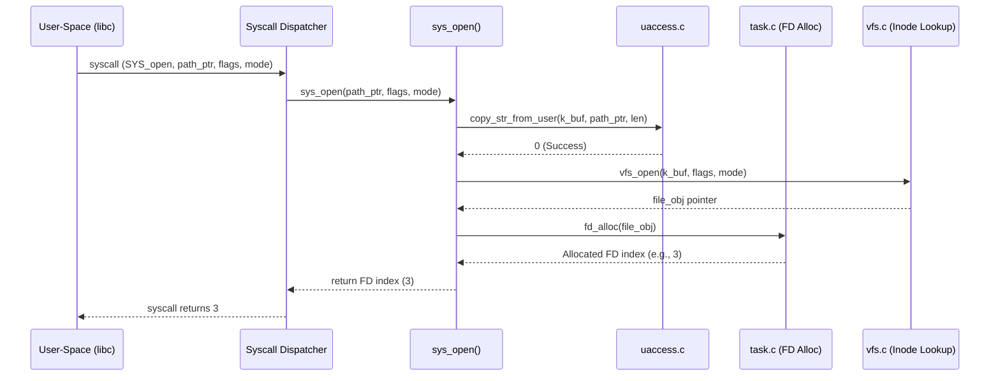

# Delfs OS Kernel Subsystem - Open System Call

This directory contains the kernel-space implementation of the `open` system call (`sys_open`) for the **Delfs** operating system.

## Directory Structure

```
kernel/
├── Makefile                 # Builds libkernel.a
├── README.md                # This documentation
├── fs/
│   ├── open.c               # System call handler: sys_open
│   └── vfs.c                # Virtual File System: inode resolution & open file pool
├── include/                 # Kernel-private headers
│   └── kernel/
│       ├── fs.h             # File/inode definitions & fd tables
│       ├── task.h           # Process structures (task_struct)
│       ├── types.h          # Kernel base types
│       └── uaccess.h        # User-space safe copy operations
├── kernel/
│   ├── task.c               # Task management & file descriptor allocation
│   └── uaccess.c            # Safe memory copying implementation
└── sys/
    └── syscall.c            # System call dispatcher (syscall router)
```

---

## Life Cycle of the `open` System Call

When user-space executes `open("test_file.txt", O_RDONLY)`, the following sequence occurs:



### 1. User-to-Kernel Boundaries & Memory Safety (`uaccess.c`)
The user space passes a pointer to a string (`const char *pathname`). The kernel **cannot** directly trust or read user-space pointers. Direct reads could cause kernel panics (if the address is invalid) or security exploits (if the memory is modified mid-operation, i.e., Time-of-Check to Time-of-Use).
- `copy_str_from_user()` copies the string into a kernel-owned page buffer. It limits the length to `MAX_PATH_LEN` to prevent buffer overflow.

### 2. VFS Inode Resolution (`fs/vfs.c`)
- The Virtual File System searches its simulated directory of files (inodes) for the filename.
- If it exists, it allocates a new `struct file` description from a kernel-wide pool.
- If it does not exist, and `O_CREAT` is specified in `flags`, it creates a new mock inode and assigns it the requested permission mode.

### 3. File Descriptor Allocation (`kernel/task.c`)
- A file descriptor is simply an index into a per-process array of open file pointers (`struct file_desc_table` inside `struct task_struct`).
- `fd_alloc()` scans the array (starting at `3`, leaving standard descriptors `0`, `1`, `2` untouched) and reserves the first empty index.
- If the table is full, it returns `-EMFILE` (Too many open files), causing the handler to release the file object and propagate the error.
